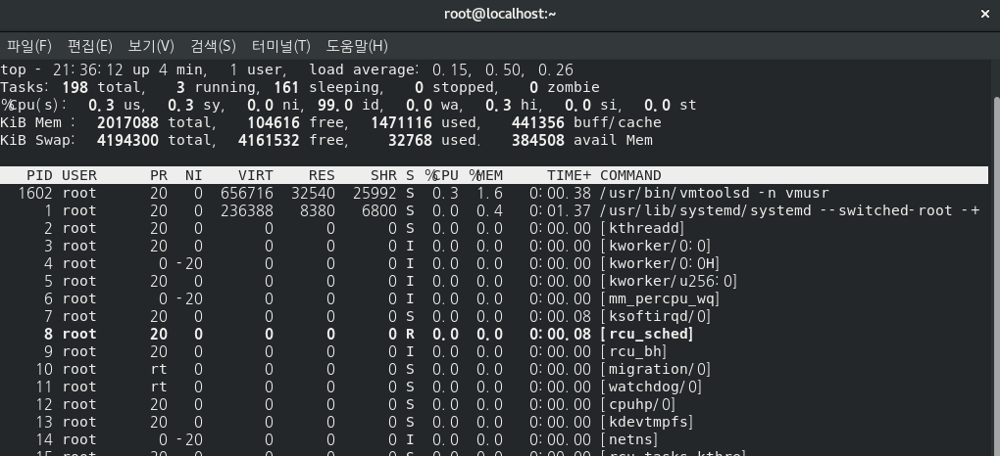
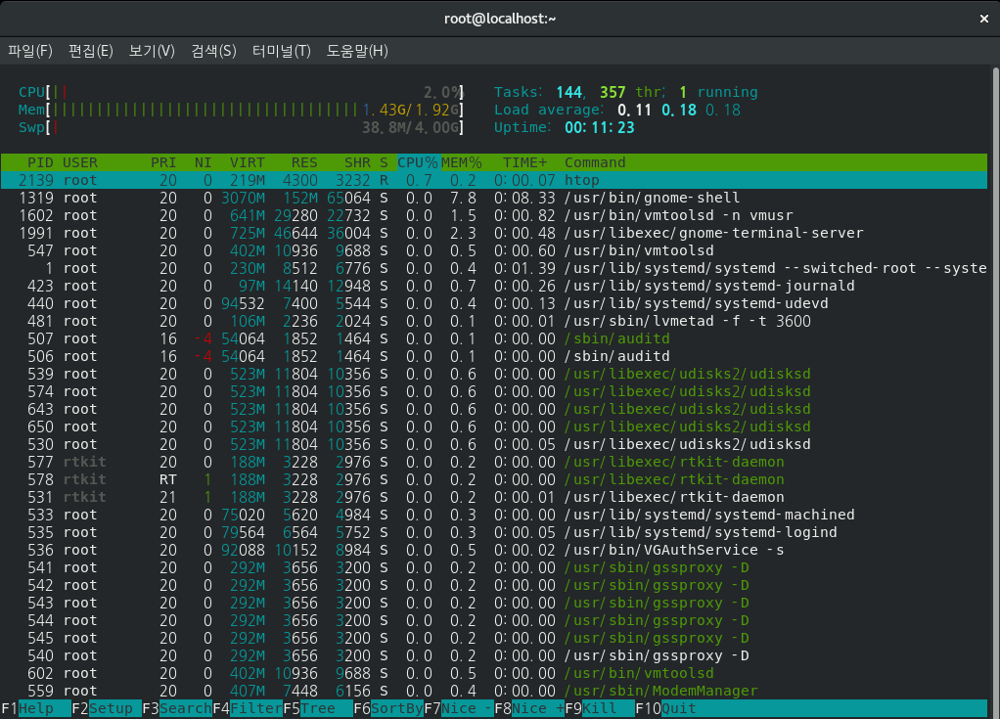
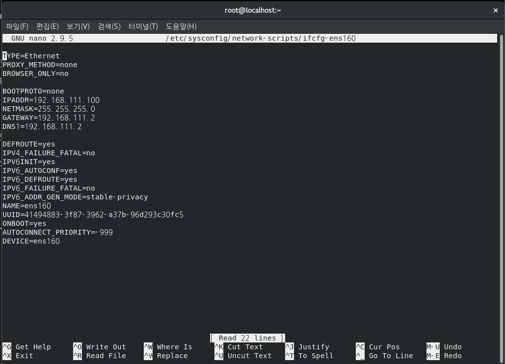

# 리눅스 시스템 관리

## 사용자 관리

### `useradd`
- 새로운 사용자 계정 `추가`
- 옵션:
  - `-m`: 사용자의 홈 디렉터리를 생성
  - `-d [디렉터리]`: 사용자의 홈 디렉터리를 지정
  - `-s [쉘]`: 사용자의 로그인 쉘을 지정
  - `-G [그룹1,그룹2,...]`: 사용자를 추가 그룹에 소속
  - `-u [UID]`: 사용자의 UID를 지정

> 예를 들어, 'newuser' 계정을 생성하고 홈 디렉터리를 '/home/newuser'로 지정하며 로그인 쉘을 '/bin/bash'로 설정하려면 다음과 같이 입력
```
[root@localhost ~]# useradd -m -d /home/newuser -s /bin/bash newuser
```

### `userdel`
- 사용자 계정 `삭제`
- 옵션: 
  - `-r`: 사용자의 홈 디렉터리와 메일 스풀도 함께 삭제

```
[root@localhost ~]# userdel -r newuser
```

### `passwd`
- 사용자 암호 설정 및 변경

```
[root@localhost ~]# passwd fedora
fedora 사용자의 비밀 번호 변경 중
새  암호:
```

### `id`
- 사용자의 UID, GID 및 소속 그룹을 확인할 수 있음

```
[root@localhost ~]# id fedora
uid=1000(fedora) gid=1000(fedora) groups=1000(fedora),10(wheel)
```

### `usermod`
- 명령어를 사용하여 사용자 계정 정보를 변경할 수 있음 
- 사용자의 로그인 쉘, 홈 디렉터리, 소속 그룹 등을 변경할 수 있음
- 옵션:
  - `-s`: 사용자의 로그인 쉘 변경
  - `-d`: 사용자의 홈 디렉터리 변경
  - `-m`: 기존의 홈 디렉터리를 새 위치로 이동
  - `-a -G`: 사용자를 여러그룹에 추가
  - `-g`: 사용자의 기본 그룹을 변경


> 'fedora'의 홈 디렉터리를 '/home/fedora1'로 변경하려면 다음과 같이 입력
```
[root@localhost ~]# usermod -d /home/fedora1 -m fedora
[root@localhost ~]# ls -l /home
합계 12
drwx------   3   1004 hanGroup 4096  3월 31 00:16 computer
drwx------. 16 fedora fedora   4096  4월 21 00:07 fedora1
drwxr-xr-x   2 root   root     4096  3월 31 00:30 myhome
```

> 'fedora'를 group1과 group2에 추가하려면 다음과 같이 입력
```
[root@localhost ~]# usermod -a -G group1,group2 fedora
[root@localhost ~]# id fedora
uid=1000(fedora) gid=1000(fedora) groups=1000(fedora),10(wheel),1005(group1),1006(group2)
```

> 'fedora'의 기본그룹을 group1으로 변경하려면 다음과 같이 입력
```
[root@localhost ~]# id fedora
uid=1000(fedora) gid=1000(fedora) groups=1000(fedora),10(wheel),1005(group1),1006(group2)

[root@localhost ~]# usermod -g group1 fedora

[root@localhost ~]# id fedora
uid=1000(fedora) gid=1005(group1) groups=1005(group1),10(wheel),1006(group2)

```

## 그룹관리

### `cat /etc/group`
- 현재 생성되어 있는 그룹 리스트 출력

```
[root@localhost ~]# cat /etc/group
```

### `groupadd`
- 새로운 그룹 생성

> 예를 들어, newFedoraGroup이라는 이름의 그룹을 생성하려면 다음과 같이 입력
```
[root@localhost ~]# groupadd newFedoraGroup
```

### `groupdel`
- 기존 그룹 삭제
- 그룹을 삭제하기 전에 그룹에 속한 모든 사용자를 다른 그룹으로 이동시켜야함
- 사용자를 이동시키지 않으면 시스템에 문제가 발생할 수 있음

> 예를 들어, newFedoraGroup이라는 이름의 그룹을 삭제하려면 다음과 같이 입력
```
[root@localhost ~]# groupdel newFedoraGroup
```

### `groupmod`
- 그룹 정보 수정
- 옵션: 
  - `-n`: 그룹 이름 변경
  - `-g`: 그룹 gid 변경

> 예를 들어, newFedoraGroup의 이름을 newFedoraGroup1으로 변경하려면 다음과 같이 입력

```
[root@localhost ~]# tail -7 /etc/group
fedora:x:1000:
fedoraGroup:x:1002:
hanGroup:x:1003:
etcGroup:x:1004:
group1:x:1005:fedora
group2:x:1006:fedora
newFedoraGroup:x:1007:

[root@localhost ~]# groupmod -n newFedoraGroup1 newFedoraGroup

[root@localhost ~]# tail -7 /etc/group
fedora:x:1000:
fedoraGroup:x:1002:
hanGroup:x:1003:
etcGroup:x:1004:
group1:x:1005:fedora
group2:x:1006:fedora
newFedoraGroup1:x:1007:
```

> 예를 들어, newFedoraGroup1의 GID를 2023으로 변경하려면 다음과 같이 입력
```
[root@localhost ~]# tail -1 /etc/group
newFedoraGroup1:x:1007:

[root@localhost ~]# groupmod -g 2023 newFedoraGroup1

[root@localhost ~]# tail -1 /etc/group
newFedoraGroup1:x:2023:
```

## 파일 시스템 관리

 - 파일 시스템은 컴퓨터의 데이터를 구조화하고 저장하는 방법
 - 리눅스에서 파일 시스템은 파일과 디렉터리로 구성
 - 여러 명령어를 사용하여 파일 시스템을 관리

### `mkdir` (make directories)
- 새 디렉터리 `생성`
- 디렉터리는 파일과 다른 디렉터리를 포함하는 컨테이너

```
[root@localhost myfolder]# ls
[root@localhost myfolder]# mkdir newfolder
[root@localhost myfolder]# ls
newfolder
```

### `cd` (change directories)
- 디렉터리 간 `이동`
```
[root@localhost ~]# pwd
/root

[root@localhost ~]# cd myfolder/

[root@localhost myfolder]# pwd
/root/myfolder
```

### `rmdir` (remove empty directories)
- 디렉터리 `삭제`
- 디렉터리가 비어있지 않으면 삭제 할 수 없음
- 디렉터리가 비어있지 않은 경우 `rm -r`을 사용하여 디렉터리를 삭제 할 수 있음

```
[root@localhost ~]# ls -l
합계 52
-rw-------. 1 root root  952  3월 10 23:40 anaconda-ks.cfg
drwxr-xr-x. 7 root root 4096  3월 11 00:11 firefox
drwxr-xr-x  3 root root 4096  4월 22 19:58 myfolder
drwxr-xr-x  2 root root 4096  4월 22 20:04 test

[root@localhost ~]# rmdir test

[root@localhost ~]# ls -l
합계 48
-rw-------. 1 root root  952  3월 10 23:40 anaconda-ks.cfg
drwxr-xr-x. 7 root root 4096  3월 11 00:11 firefox
drwxr-xr-x  3 root root 4096  4월 22 19:58 myfolder
```

### `touch`
- 새 파일 `생성`

```
[root@localhost myfolder]# ls -l
합계 4
drwxr-xr-x 2 root root 4096  4월 22 19:58 newfolder

[root@localhost myfolder]# touch newtext.txt

[root@localhost myfolder]# ls -l
합계 4
drwxr-xr-x 2 root root 4096  4월 22 19:58 newfolder
-rw-r--r-- 1 root root    0  4월 22 20:11 newtext.txt
```

### `cp`
- 파일 복사

```
[root@localhost myfolder]# ls
newfolder  newtext.txt

[root@localhost myfolder]# cp newtext.txt copy_text.txt

[root@localhost myfolder]# ls
copy_text.txt  newfolder  newtext.txt
```

### `mv`
- 파일을 이동하거나 이름을 변경

> 파일 이동을 하는 경우
```
[root@localhost myfolder]# ls
copy_text.txt  newfolder  newtext.txt

[root@localhost myfolder]# mv copy_text.txt newfolder

[root@localhost myfolder]# ls
newfolder  newtext.txt

[root@localhost myfolder]# cd newfolder/
[root@localhost newfolder]# ls
copy_text.txt
```

> 파일 이름을 변경 하는 경우
```
[root@localhost newfolder]# ls
copy_text.txt

[root@localhost newfolder]# mv copy_text.txt rename_text.txt

[root@localhost newfolder]# ls
rename_text.txt
```

### `rm`
- 파일 삭제

```
[root@localhost newfolder]# ls
rename_text.txt

[root@localhost newfolder]# rm rename_text.txt 
rm: remove 일반 빈 파일 'rename_text.txt'? y

[root@localhost newfolder]# ls
[root@localhost newfolder]# 
```

### `cat`
- 파일의 전체 내용을 출력

```
[root@localhost newfolder]# cat text.txt
```

### `less`
- 파일의 내용을 페이징하여 출력
- 큰 파일의 내용을 확인할 때 유용 
- less를 사용하면 키보드 화살표를 사용하여 위아래로 스크롤할 수 있음 
- 검색 기능 제공
- less를 사용하는 동안 다음 명령어를 사용할 수 있음
  - 위/아래 화살표: 한 줄씩 스크롤
  - Page Up/Page Down: 한 페이지씩 스크롤
  - / 문자열: 문자열 검색
  - q: less 종료

```
[root@localhost newfolder]# less text.txt
```

### `more`
- less와 비슷한 기능을 제공하지만, 더 단순한 버전
- more를 사용하여 파일의 내용을 페이징하여 출력할 수 있음 
- 화면이 빠르게 스크롤되지 않음
- more에서는 위 화살표로 스크롤할 수 없고, 페이지 단위로만 이동할 수 있음 
- more를 사용하는 동안 다음 명령어를 사용할 수 있음
  - Enter: 한 줄씩 스크롤
  - Space: 한 페이지씩 스크롤
  - q: more 종료
```
[root@localhost newfolder]# more text.txt
```

## 프로세스 관리

- 프로세스는 실행 중인 프로그램의 인스턴스
- 시스템 자원을 사용하고 관리하며 서로 독립적으로 작동
- 리눅스에서는 다양한 명령어를 사용하여 프로세스를 관리할 수 있음

### `ps`
- 프로세스 목록 확인
- 옵션: 
  - `-e`: 시스템의 모든 프로세스 나열
  - `-f`: 프로세스에 대한 상세 정보 표시
  - `-ef`: 시스템의 모든 프로세스와 상세정보를 표시

```
[root@localhost ~]# ps

   PID TTY          TIME CMD
  1765 pts/0    00:00:00 bash
  1885 pts/0    00:00:00 ps
```
```
[root@localhost ~]# ps -ef

UID         PID   PPID  C STIME TTY          TIME CMD
root          1      0  2 22:31 ?        00:00:01 /usr/lib/systemd/systemd --switched-root --system --deserializ
root          2      0  0 22:31 ?        00:00:00 [kthreadd]
root          3      2  0 22:31 ?        00:00:00 [kworker/0:0]
root          4      2  0 22:31 ?        00:00:00 [kworker/0:0H]
root          5      2  0 22:31 ?        00:00:00 [kworker/u256:0]
root          6      2  0 22:31 ?        00:00:00 [mm_percpu_wq]
...
```

### `pstree`
- 실행 중인 프로세스들의 트리 구조를 확인할 수 있음
- 이를 통해 부모-자식 관계를 쉽게 파악

```
[fedora@localhost ~]$ pstree

systemd─┬─ModemManager───2*[{ModemManager}]
        ├─NetworkManager───2*[{NetworkManager}]
        ├─VGAuthService
        ├─abrt-dbus───2*[{abrt-dbus}]
        ├─3*[abrt-dump-journ]
        ├─abrtd───2*[{abrtd}]
        ...
```

### `top`,`htop`
- 실행 중인 프로세스의 상태를 실시간으로 확인하고 관리할 수 있는 도구
- `top`을 실행하면 CPU, 메모리 사용률 등의 정보를 확인할 수 있으며, 키보드 명령으로 프로세스를 종료하거나 우선 순위를 변경할 수 있음

```
[root@localhost ~]# top
```


- `htop`는 top과 비슷한 기능을 제공하지만, 사용자 인터페이스가 더 직관적임 
- htop을 사용하려면 먼저 설치해야 함

```
[root@localhost ~]# dnf install htop //  Fedora, CentOS, RHEL 인 경우
[root@localhost ~]# apt-get install htop //  Debian, Ubuntu 계열 인 경우
.
..
...
[root@localhost ~]# htop
```


### `kill` 
- 프로세스 ID(PID)를 사용하여 특정 프로세스를 종료할 수 있음 
- `-9` 옵션을 사용하면 강제종료 가능

> 예를 들어, 프로세스 ID가 2054인 프로세스를 종료하려면 다음과 같이 입력

```
[fedora@localhost ~]$ kill 2054
```

### `killall`
- 프로세스 이름을 사용하여 프로세스를 종료
- 해당 명령어를 사용하면 같은 이름의 모든 프로세스가 종료됨

```
[fedora@localhost ~]$ killall crypto
```

### `pkill`
- 프로세스 이름을 사용하여 프로세스를 종료
- 해당 명령어를 사용하면 같은 이름의 프로세스 중 첫 번째 프로세스가 종료됨

```
[fedora@localhost ~]$ pkill crypto
```

### `nice`

- `nice` 명령어를 사용하여 프로세스의 우선 순위를 설정하고 프로세스를 실행할 수 있음
- 낮은 값은 높은 우선 순위를 의미하며, 높은 값은 낮은 우선 순위를 의미함 
- 기본값은 0

> 예를 들어 crypto라는 프로세스의 우선순위를 10으로 설정하고 실행하려면 아래와 같이 입력
```
[fedora@localhost ~]$ nice -n 10 crypto
```

### `renice`
- 현재 실행중인 프로세스의 우선순위를 변경
- 현재 실행중인 프로세스의 우선순위값은 `top`의 `NI`열의 숫자로 확인 가능 
- 옵션: 
  - `-n`: 프로세스의 우선순위 값을 지정(값은 -20 ~ 19 사이의 정수)
  - `-p`: PID를 지정하여 프로세스 우선순위를 변경
  - `-g`: 프로세스 그룹의 우선순위를 변경
  - `-u`: 사용자의 모든 프로세스의 우선순위를 변경

> 예를 들어 PID가 2023인 프로세스의 우선 순위를 변경하려면 아래와 같이 입력
```
[fedora@localhost ~]$ nice -n 11 -p 2023
```

## 네트워크 설정 및 관리

### `ifconfig`
- 네트워크 인터페이스 확인
- 현재 사용중인 네트워크 정보를 확인 할 수 있음
- `ifconfig` 또는 `ip addr show`를 사용

```
[root@localhost ~]# ifconfig

ens160: flags=4163<UP,BROADCAST,RUNNING,MULTICAST>  mtu 1500
        inet 192.168.111.100  netmask 255.255.255.0  broadcast 192.168.111.255
        inet6 fe80::20b2:5210:91c7:61b7  prefixlen 64  scopeid 0x20<link>
        ether 00:0c:29:64:11:d7  txqueuelen 1000  (Ethernet)
        RX packets 45785  bytes 68373546 (65.2 MiB)
        RX errors 0  dropped 0  overruns 0  frame 0
        TX packets 6360  bytes 362053 (353.5 KiB)
        TX errors 0  dropped 0 overruns 0  carrier 0  collisions 0

lo: flags=73<UP,LOOPBACK,RUNNING>  mtu 65536
        inet 127.0.0.1  netmask 255.0.0.0
        inet6 ::1  prefixlen 128  scopeid 0x10<host>
        loop  txqueuelen 1000  (Local Loopback)
        RX packets 7  bytes 745 (745.0 B)
        RX errors 0  dropped 0  overruns 0  frame 0
        TX packets 7  bytes 745 (745.0 B)
        TX errors 0  dropped 0 overruns 0  carrier 0  collisions 0
```

### `nmcli`
- 현재 사용중인 네트워크설정을 변경하는 도구
- `device show`: 현재 사용중인 네트워크 장치에 대한 정보를 표시
```
[root@localhost ~]# nmcli device show
GENERAL.DEVICE:                         ens160
GENERAL.TYPE:                           ethernet
GENERAL.HWADDR:                         00:0C:29:64:11:D7
GENERAL.MTU:                            1500
GENERAL.STATE:                          100 (연결됨)
GENERAL.CONNECTION:                     ens160
GENERAL.CON-PATH:                       /org/freedesktop/NetworkManager/ActiveConnection/1
WIRED-PROPERTIES.CARRIER:               켜짐
IP4.ADDRESS[1]:                         192.168.111.100/24
IP4.GATEWAY:                            192.168.111.2
IP4.ROUTE[1]:                           dst = 192.168.111.0/24, nh = 0.0.0.0, mt = 100
IP4.ROUTE[2]:                           dst = 0.0.0.0/0, nh = 192.168.111.2, mt = 100
IP4.DNS[1]:                             192.168.111.2
IP6.ADDRESS[1]:                         fe80::20b2:5210:91c7:61b7/64
IP6.GATEWAY:                            --
IP6.ROUTE[1]:                           dst = ff00::/8, nh = ::, mt = 256, table=255
IP6.ROUTE[2]:                           dst = fe80::/64, nh = ::, mt = 256
IP6.ROUTE[3]:                           dst = fe80::/64, nh = ::, mt = 100

GENERAL.DEVICE:                         lo
GENERAL.TYPE:                           loopback
GENERAL.HWADDR:                         00:00:00:00:00:00
GENERAL.MTU:                            65536
GENERAL.STATE:                          10 (관리되지 않음)
GENERAL.CONNECTION:                     --
GENERAL.CON-PATH:                       --
IP4.ADDRESS[1]:                         127.0.0.1/8
IP4.GATEWAY:                            --
IP6.ADDRESS[1]:                         ::1/128
IP6.GATEWAY:                            --
```
- `nmcli connection modify ... `: 현재 사용중인 네트워크 장치의 설정 변경
```
[root@localhost ~]# nmcli connection modify 장치이름 ipv4.method manual ipv4.addresses "192.168.1.100/24" ipv4.gateway 192.168.1.1 ipv4.dns "8.8.8.8"
[root@localhost ~]# nmcli connection up 장치이름 // 위의 변경을 완료 후 해당 명령어를 통해 연결을 상태를 업데이트 해줘야함
```

### `네트워크 설정파일 수정`
- `nmcli`을 사용하지 않고 `네트워크 설정파일`을 수정하여 네트워크 설정을 변경 할 수 있음
- Debian, Ubuntu, Mint 등 Debian 계열
  - `/etc/network/interfaces`: 네트워크 인터페이스와 IP 주소, 게이트웨이, DNS 서버 등의 정보를 설정
  - `/etc/network/interfaces.d/`: 네트워크 인터페이스 설정을 따로 파일로 분리해서 관리할 수 있음
- RHEL, CentOS, Fedora 등 Red Hat 계열
  - `/etc/sysconfig/network-scripts/ifcfg-eth0`: 네트워크 인터페이스 설정 파일, 이더넷 인터페이스의 이름에 따라 파일 이름이 달라짐
  - `/etc/resolv.conf`: DNS 서버 주소를 설정
  - `/etc/hosts`: 호스트 이름과 IP 주소를 매핑

```
[root@localhost ~]# nano /etc/sysconfig/network-scripts/ifcfg-ens160
```


- 네트워크 설정파일을 수정하고 저장하였다면 네트워크를 재시작 해줘야 변경사항이 적용 됨

```
[root@localhost ~]# systemctl restart networking      //Debian, Ubuntu, Mint 등 Debian 계열
[root@localhost ~]# systemctl restart Network         //RHEL, CentOS 등 Red Hat 계열
[root@localhost ~]# systemctl restart NetworkManager  //Fedora
```

### `ping`
- 네트워크 연결 확인

```
[root@localhost ~]# ping www.google.com

PING www.google.com (216.58.203.68) 56(84) bytes of data.
64 bytes from kul09s03-in-f4.1e100.net (216.58.203.68): icmp_seq=1 ttl=128 time=75.1 ms
64 bytes from kul09s03-in-f4.1e100.net (216.58.203.68): icmp_seq=2 ttl=128 time=82.1 ms
64 bytes from kul09s03-in-f4.1e100.net (216.58.203.68): icmp_seq=3 ttl=128 time=65.1 ms
.
..
...
--- www.google.com ping statistics ---
7 packets transmitted, 7 received, 0% packet loss, time 6010ms
rtt min/avg/max/mdev = 65.177/76.996/83.777/5.712 ms
```

### `netstat` or `ss`
- 시스템에서 사용 중인 포트와의 연결 상태 확인
- 네트워크 연결, 라우팅 테이블, 인터페이스 상태 등을 확인하는 명령어
- 옵션: 
  - `-tuln`:  TCP 연결(-t), UDP 연결(-u), Listening 상태의 소켓(-l), 숫자 형태로 표시(-n)하는 옵션, 이 옵션을 사용하면 현재 시스템에서 사용 중인 TCP 및 UDP 포트 및 해당 프로세스 ID를 확인할 수 있음
```
[root@localhost ~]# netstat -tuln

Active Internet connections (only servers)
Proto Recv-Q Send-Q Local Address           Foreign Address         State      
tcp        0      0 127.0.0.1:631           0.0.0.0:*               LISTEN     
tcp6       0      0 ::1:631                 :::*                    LISTEN     
udp    46976      0 0.0.0.0:5353            0.0.0.0:*                          
udp        0      0 0.0.0.0:45364           0.0.0.0:*                          
udp        0      0 127.0.0.1:323           0.0.0.0:*                          
udp6   35072      0 :::5353                 :::*                               
udp6       0      0 ::1:323                 :::*                               
udp6       0      0 :::51606                :::*  
```

### `nc` (netcat)
- TCP/IP 소켓에 데이터를 전송하거나 수신할 수 있는 유틸리티
- 네트워크 디버깅, 서비스 테스트, 데이터 전송 등에 사용

```
nc [옵션] 호스트명 포트번호 // nc명령어가 사용 되는 포맷
```

- 옵션: 
  - `-l` 옵션: nc를 서버로 동작시킴
  - `-p` 옵션: 사용할 포트 번호를 지정
  - `-v` 옵션: 디버그 메시지를 출력

- 사용: 
  - `TCP/IP 서비스 테스트`: nc 명령어를 사용하여 원격 호스트의 특정 포트에 접속하여 서비스가 제대로 동작하는지 확인할 수 있음
  - `파일 전송`: nc 명령어를 사용하여 파일을 전송할 수 있음
  - `채팅`: 포트를 열어 서버와 클라이언트간 채팅 가능

